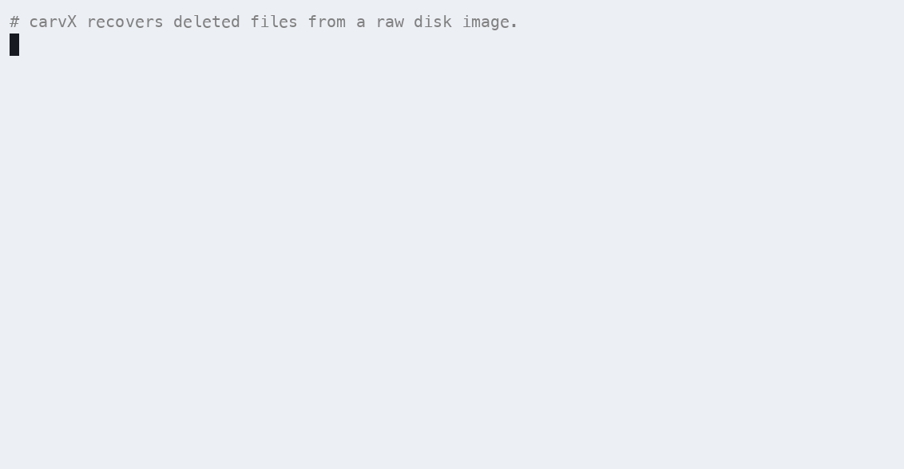

# BreadCrumb

[](https://github.com/sltcnb/BreadCrumb/actions/workflows/ci.yml)
[](https://www.python.org/)
[](LICENSE)
[](pyproject.toml)

Signature-based file carver for disk images and block devices, in the spirit of
PhotoRec / Sleuth Kit. Recovers deleted files by scanning raw bytes, no
filesystem metadata needed, so it works on formatted, corrupted, or unknown
filesystems and on unallocated space.

Pure Python 3.10+, stdlib only.

## Demo

<p align="center"></p>

## Install

```sh
pip install -e .
# or run without installing:
python3 -m breadcrumb --help
```

Pure Python 3.10+ / stdlib only. Optional extras improve specific features:
`Pillow` (full JPEG/PNG decode for `--validate` + JPEG bifragment),
`libewf-python` (wider EWF/E01 coverage, `pip install breadcrumb[ewf]`;
the module it provides is `pyewf`), `pyahocorasick` (faster matching with
huge signature sets). Disk-image formats (raw, split, EWF/E01, QCOW2, VMDK)
are auto-detected, see [Image formats](#image-formats).

## Usage

```sh
# carve a disk image
bcrumb image.dd -o recovered/

# carve a whole disk (raw devices need root; on macOS prefer /dev/diskN
# over /dev/rdiskN: rdisk requires block-aligned reads)
sudo bcrumb /dev/disk4 -o recovered/          # macOS
sudo bcrumb /dev/sdb -o recovered/            # Linux
bcrumb \\.\PhysicalDrive1 -o recovered\       # Windows (admin shell)
bcrumb \\.\D: -o recovered\                   # Windows, single volume

# every Office/document container in one sweep (doc/xls/ppt, docx/xlsx/pptx,
# pdf, rtf, odf) -- see --list-types for the other groups
bcrumb disk.dd -t office -o out

# only some types
bcrumb image.dd -t jpg,png,pdf,sqlite -o out/

# scan a region (e.g. one partition: offset + length)
bcrumb /dev/disk4 --offset 209735680 --length 64G -o out/

# faster scan of a filesystem with known cluster alignment
bcrumb image.dd --align 4096 -o out/

# inventory only, write nothing
bcrumb image.dd --dry-run

# go faster: 8 parallel scan processes (0 = all cores)
bcrumb image.dd -j 8 -o out/

# also emit CSV + Sleuth Kit bodyfile; hash the whole source for custody
bcrumb image.dd -o out/ --csv out/files.csv --bodyfile out/bodyfile --hash-source

# JSON-lines events on stdout (for wrapping in a GUI/pipeline)
bcrumb image.dd --machine -o out/

# deep-validate carves (decode JPEG/PNG/ZIP/gzip/SQLite), drop ones that fail
bcrumb image.dd --validate -o out/
bcrumb image.dd --drop-failed -o out/

# filesystem-metadata undelete (recovers names, paths, timestamps):
bcrumb image.dd --ntfs  -o out/    # NTFS  (Windows)
bcrumb image.dd --ext4  -o out/    # ext2/3/4 (Linux)
bcrumb image.dd --fat   -o out/    # FAT12/16/32 + exFAT (SD/USB/cameras)

# whole disk: list partitions, then auto-detect FS + undelete each
bcrumb disk.dd --list-partitions
bcrumb disk.dd --auto -o out/

# list supported types
bcrumb --list-types
```

## Modes

**Carving** (default): scans raw bytes for file signatures. Filesystem-agnostic,
recovers from unallocated space, but only contiguous files and no original names.
`--validate` additionally decodes each carve to confirm integrity and trim tails.

**Filesystem undelete**: parses filesystem metadata for deleted entries,
recovering **original filenames, directory paths, timestamps, and (where the
metadata survives) fragmented files**:

| flag     | filesystems            | fragmentation        | notes |
|----------|------------------------|----------------------|-------|
| `--ntfs` | NTFS                   | yes (MFT runlists)   | skips compressed/encrypted streams |
| `--ext4` | ext2 / ext3 / ext4     | yes (extents + indirect blocks) | names from dir-entry slack |
| `--fat`  | FAT12/16/32, exFAT     | first run only       | long names reconstructed from VFAT/exFAT entries |
| `--hfs`  | HFS+ / HFSX            | yes (extent records) | live files always; deleted only if catalog record survives the journal |
| `--apfs` | APFS                   | yes (file extents)   | copy-on-write scan recovers deleted files (name+size+data) from old node copies |

Each auto-locates its volume through the MBR/GPT/APM partition table, or takes
an explicit `--offset`. Best-effort recoveries (possibly reused clusters,
fragmented FAT files) are flagged low confidence.

> **Note on HFS+:** a clean unmount journals deleted catalog records away, so
> deleted *names* often can't be recovered, but the file *data* still is, via
> carving mode. APFS, being copy-on-write, retains superseded records and
> recovers deleted files with names + exact content far more reliably.

**Whole disk**: `--list-partitions` prints the MBR/GPT/APM table with the
filesystem detected at each partition. `--auto` then runs the matching undelete
mode on every partition (carving any whose filesystem isn't recognized), writing
each to its own `part<N>_<fs>/` subdirectory.

## Options

| flag             | default        | effect                                          |
|------------------|----------------|-------------------------------------------------|
| `-o, --output`   | `./carved`     | output directory                                |
| `-t, --types`    | all            | comma-separated type list (aliases ok: jpeg, docx, mov, ...) |
| `--offset`       | 0              | start offset into source (K/M/G suffixes)       |
| `--length`       | to end         | bytes to scan from offset                       |
| `--align N`      | 1              | accept headers only at N-byte alignment         |
| `--max-size`     | per-type       | global cap on carved file size                  |
| `--min-size`     | 0              | discard smaller carves                          |
| `--chunk`        | 32M            | scan chunk size                                 |
| `-j, --jobs N`   | 1              | parallel scan processes (0 = all cores)         |
| `--ntfs`         | off            | NTFS MFT undelete mode                           |
| `--ext4`         | off            | ext2/3/4 inode + dirent undelete mode            |
| `--fat`          | off            | FAT12/16/32 + exFAT undelete mode                |
| `--hfs`          | off            | HFS+/HFSX catalog undelete mode                  |
| `--apfs`         | off            | APFS copy-on-write recovery mode                 |
| `--auto`         | off            | detect partitions + FS, undelete each            |
| `--list-partitions` |             | print MBR/GPT/APM table and exit                 |
| `--grep PATTERN` |                | keyword/regex search (ASCII+UTF-16); repeatable  |
| `--sig-file FILE`|                | load user-defined signatures (JSON)              |
| `--timeline FILE`|                | write MACB timeline (.csv/.jsonl)                |
| `--html FILE`    |                | write HTML report + image gallery                |
| `--validate`     | off            | deep-decode carves; set verified/failed confidence |
| `--drop-failed`  | off            | with --validate, discard carves that fail decode |
| `--no-bifragment`| off            | disable bifragment gap reassembly                |
| `--no-skip-blank`| off            | scan all-zero (TRIM'd/sparse) regions too        |
| `--matcher`      | auto           | signature matcher backend (auto/regex/aho-corasick) |
| `--no-skip`      | off            | keep scanning inside carved files               |
| `--no-dedup`     | off            | keep hash-identical duplicate carves            |
| `--dry-run`      | off            | report findings, write nothing                  |
| `--report FILE`  | `<out>/manifest.json` | JSON manifest path                       |
| `--csv FILE`     |                | also write findings as CSV                       |
| `--bodyfile FILE`|                | also write Sleuth Kit bodyfile (for mactime)    |
| `--hash-source`  | off            | SHA-256 whole source into manifest (custody)    |
| `--machine`      | off            | JSON-lines events on stdout                      |
| `-q, --quiet`    | off            | suppress progress output                        |
| `--list-types`   |                | print signature table and exit                  |

## Supported types

| type   | files                          | end detection                              |
|--------|--------------------------------|--------------------------------------------|
| jpg    | JPEG                           | marker walk + entropy scan to EOI           |
| png    | PNG                            | chunk walk to IEND                          |
| gif    | GIF87a/89a                     | block walk to trailer                       |
| bmp    | BMP                            | header size field                           |
| tif    | TIFF                           | IFD + strip/tile extent walk                |
| pdf    | PDF                            | last `%%EOF` (bounded by next PDF header)   |
| zip    | ZIP, docx/xlsx/pptx/vsdx, jar, apk, epub, odf | local-header member walk, then central dir + EOCD |
| gz     | gzip                           | zlib stream decode (multi-member)           |
| 7z     | 7-Zip                          | next-header offset in signature header      |
| rar    | RAR4/5                         | none, capped carve, unvalidated            |
| sqlite | SQLite 3                       | page_size × page_count                      |
| mp4    | MP4 / MOV                      | top-level box walk                          |
| riff   | WAV, AVI, WebP                 | RIFF size field                             |
| mp3    | MP3 (ID3v2-tagged)             | ID3 size + profile-locked MPEG frame walk   |
| exe    | PE (exe/dll)                   | section table + Authenticode cert           |
| elf    | ELF                            | section header table end                    |
| macho  | Mach-O thin + universal        | load command / fat arch extents             |
| ole    | OLE2/CFB: doc, xls, ppt, msg, vsd, pub, msi | FAT max-used-sector walk; type from the root CLSID, then stream names |
| pst    | Outlook store (.pst/.ost)      | size from the header's ROOT.ibFileEof        |
| rtf    | Rich Text Format               | brace depth, honouring escapes and `\binN` blobs |
| mp4    | MP4/MOV/HEIC/AVIF/3GP/M4A/M4V   | ISO-BMFF box walk + brand-based extension   |
| mkv    | Matroska / WebM                | EBML element + Segment size                 |
| ogg    | OGG (Vorbis/Opus/Theora)       | page walk to end-of-stream                  |
| flac   | FLAC                           | metadata blocks (frames best-effort)        |
| psd    | Photoshop                      | section walk (image data best-effort)       |
| ico    | ICO / CUR                      | directory entry table extent                |
| evtx   | Windows event log              | header chunk count                          |
| hive   | Windows registry (regf)        | base block + hbins size                     |
| plist  | Apple binary plist             | trailer offset-table identity               |

Every carve gets a SHA-256 and lands in `<out>/<ext>/f_<offset>.<ext>`.
A JSON manifest (`<out>/manifest.json`) records offset, size, hash, and
whether the structure parsed cleanly (`validated`) or the size is a
best-effort fallback.

## Image formats

`open_source()` detects the format by magic, falling back to the extension, so
you pass the image straight to `bcrumb` with no conversion step:

| Format | Detection | Notes |
| ------ | --------- | ----- |
| raw / dd | default | also block devices (`/dev/diskN`) and `-` for stdin |
| split raw | `.001/.002…`, `name.NNN` | segments globbed from the first |
| EWF / E01 | `EVF\x09…` magic, or `.e01/.ex01/.s01/.l01` | see below |
| QCOW2 v2/v3 | `QFI\xfb` | raw + zlib clusters |
| VMDK | `KDMV` | flat + monolithic sparse |

For EWF the built-in reader is pure Python: it walks the section list, reads
the chunk table, and handles stored and deflate-compressed chunks, EnCase5/6,
SMART (`.s01`) and `ewfx` layouts, and multi-segment sets. Media size comes from
the volume section's sector count, so carve offsets match the original disk
exactly.

Pass the **first segment only**, `bcrumb RM.E01`, and the rest are found by
name, through the full libewf sequence (`E01`…`E99`, then `EAA`…`EZZ`, `FAA`…).
Segments must be siblings with consecutive names. If any are missing, the read
is refused with a count of what was found rather than silently carving a
fraction of the evidence.

Install `libewf-python` (`pip install breadcrumb[ewf]`) and libewf is used
instead wherever it is present, needed for the variants the built-in reader
does not model: **Ex01/EWF2**, bzip2-compressed chunks, and encrypted EWF.

## Filesystem & OS support

Carving is filesystem-agnostic: it scans raw bytes, so NTFS, ext2/3/4, FAT,
exFAT, APFS, XFS, btrfs, corrupted or unknown filesystems all work the same.
Runs on Linux, macOS, and Windows (raw device access uses sector-aligned
reads and IOCTL size detection automatically).

Inherent carving limits (same for PhotoRec):

- Only **contiguous** files recover intact, fragmented files yield the first
  fragment plus junk.
- NTFS-compressed or EFS-encrypted files are not in raw format on disk.
- Full-disk encryption: **BitLocker is unlocked transparently** when you
  supply a credential (see below); LUKS/FileVault still need the unlocked
  device.
- TRIM'd SSD blocks read back as zeros, unrecoverable by any tool.
- No filenames/timestamps. That requires filesystem metadata recovery
  (Sleuth Kit `fls`/`icat` territory), not carving.

## BitLocker (Windows FVE)

BreadCrumb decrypts BitLocker volumes **in place**: supply a credential and the
locked volume reads back as plaintext NTFS at the same offset, so carving,
the `--ntfs`/`--auto` undelete modes, `--grep`, and `--list-partitions` all
work as if the disk were never encrypted.

```bash
# carve a recovery-key-protected SSD image (XTS-AES, the Win10/11 default)
bcrumb disk.E01 --bitlocker-recovery-key 471806-...-635835 -o out

# whole-disk auto mode: detect the BitLocker partition, unlock, undelete NTFS
bcrumb /dev/sdb --auto --bitlocker-recovery-key 471806-...-635835

# other protectors
bcrumb disk.dd --bitlocker-password 'Hunter2!'        # user passphrase
bcrumb disk.dd --bitlocker-bek startup.BEK            # startup key file
bcrumb disk.dd --bitlocker-fvek 0011aabb...           # raw FVEK (hex)
```

Supported ciphers: AES-XTS-128/256 (Windows 8+/10/11, incl. SSDs),
AES-CBC-128/256, and AES-CBC + Elephant diffuser (Vista/7). Suspended volumes
(clear-key protector) unlock with no credential. Decryption is pure-Python and
read-only; installing the optional `cryptography` package (`pip install
breadcrumb[bitlocker]`) swaps in C-backed AES for a large speedup.

## Notes

- By default BreadCrumb skips over validated carves (PhotoRec behavior). Use
  `--no-skip` to also find files embedded inside other files.
- Unvalidated carves (rar, legacy sqlite, gz at window edge) may have junk
  appended at the tail, the real data is at the front.
- Throughput is roughly 150–250 MiB/s single-threaded; mostly bounded by
  the regex scan and source read speed. `-j 0` scales it across cores, and the
  [Rust port](#rust-port) carves the same bytes several times faster.
- Operate on a read-only image (`dd`/`ddrescue` copy) of evidence, never on
  the original, standard forensic practice.

## Output

Each carve lands in `<out>/<ext>/f_<offset>.<ext>` (carving) or
`<out>/ntfs/<recovered/path>` (NTFS), with a SHA-256. The JSON manifest
(`<out>/manifest.json`) records, per file: offset/MFT number, size, hash,
`validated`/`confidence`, `duplicate_of`, and (NTFS) original name + timestamps.
Plus scan metadata: tool version, source path/size, start/finish time, options,
optional whole-source hash. CSV and Sleuth Kit bodyfile exports are optional.

## Rust port

[breadcrumb-rs](https://github.com/sltcnb/breadcrumb-rs) ports the **carving
core** to Rust for throughput: 20 of the 26 signature types, same handlers, same
output layout. Manifests from the two tools agree byte for byte, matching
`(offset, size, sha256, ext, validated, duplicate_of)` on every record, and the
scan runs about 7x faster, since a native multi-pattern matcher with a SIMD
prefilter replaces the `re` alternation that dominates the Python profile.

Everything past the carve stays here: the filesystem undelete modes, BitLocker,
the EWF/QCOW2/VMDK readers, `--validate`, `--grep`, and the derived reports. This
implementation is the reference.

## Not filling the disk

A carve can write more than the target volume holds: on a 238 GB image an
unfiltered run reached 51 GB inside the first percent. Free space is checked
before anything is written, and the scan stops itself rather than filling the
filesystem, a full root filesystem takes the machine with it.

```
$ bcrumb disk.E01 -t office -o out
output: 55.0 GiB free on the target volume, stopping at 2.0 GiB
```

- `--min-free SIZE`: floor on free space, default **2G**. The run refuses to
  start below it and stops on reaching it. `--min-free 0` disables the check.
- `--max-output SIZE`: ceiling on carved bytes. The scan stops cleanly and the
  manifest still describes everything written.
- `--dry-run` writes nothing and still produces the manifest, which is the cheap
  way to size a job first.

## Deletion timestamps

Carving recovers bytes, never metadata, no names, no dates. `--ntfs` recovers
names, paths and the MFT timestamps (created, modified, MFT-changed, accessed),
but NTFS has no "deleted" timestamp: the record's change time is only a proxy.

Two artefacts record deletion directly, and both are parsed:

| Artefact | What it gives |
| --- | --- |
| `$Recycle.Bin/$I*` | deletion time, original size, and the full original path, per Explorer-deleted file (v1 Vista–8.1 and v2 Win10+ layouts) |
| `$Extend/$UsnJrnl:$J` | the change journal: an explicit `file-delete` reason and timestamp per record (USN v2 and v3) |

```sh
# recover the filesystem and write a deletion timeline in one pass
bcrumb disk.E01 --ntfs -o out --deleted-times deleted.csv \
    --bitlocker-recovery-key 650441-...-609257

# or parse artefacts recovered earlier
bcrumb --parse-usn 'out/ntfs/$Extend/$UsnJrnl-$J' --deleted-times deleted.csv
bcrumb --parse-recycle 'out/ntfs/$Recycle.Bin'
```

```
2026-08-19 16:45:12  $UsnJrnl  contract.docx
2026-08-19 16:45:12  $I        C:\Users\jl\Desktop\contract.docx
2026-08-21 08:02:33  $UsnJrnl  notes.txt
```

The journal is sparse and a carved copy often starts mid-record, so the parser
steps over zero runs and resynchronises rather than stopping at the first bad
length. `bcrumb --help` lists a command per scenario.

## Web UI

An optional Flask front-end lives in [`web/`](web/README.md): drag-and-drop a
disk image, pick a mode, watch live progress, browse and download the carve.
It shells out to this package (`python -m breadcrumb --machine`) rather than
bundling a copy, so it always carves exactly what the CLI does. Flask is
needed only for the web UI; the carver itself stays stdlib-only.

```sh
cd web
python3 -m venv venv
venv/bin/pip install -r requirements.txt
venv/bin/python -m breadcrumb_web        # http://127.0.0.1:5050
```

## Tests

```sh
pip install pytest
pytest tests/                     # 170+ tests
pytest -q web/tests               # web UI (needs web/requirements.txt)

# or the standalone integration check (no pytest needed):
python3 tests/make_test_image.py
```

The suite builds synthetic images (one per supported type, a synthetic NTFS
volume, and **real ext4/FAT32/exFAT/HFS+/APFS images** via the OS formatters
when available) with deleted + fragmented files, and verifies every recovery
hash-matches the original. Handler tests also feed truncated, corrupted, and
pure-noise input to confirm no crashes and no false-positive validated carves.
Disk-image readers are checked against `qemu-img`-produced QCOW2/VMDK. Tests
that need an unavailable tool skip cleanly rather than fail.

## Contributing

Contributions are welcome. See [CONTRIBUTING.md](CONTRIBUTING.md) for the
development setup and the project's ground rules, most importantly the
**stdlib-only** runtime constraint. Security issues should be reported
privately per [SECURITY.md](SECURITY.md).

## Disclaimer

BreadCrumb is intended for legitimate data recovery and digital forensics. Only use
it on media you own or are authorised to examine. Always work on a read-only
copy of evidence, never the original.

## License

Released under the [MIT License](LICENSE).
